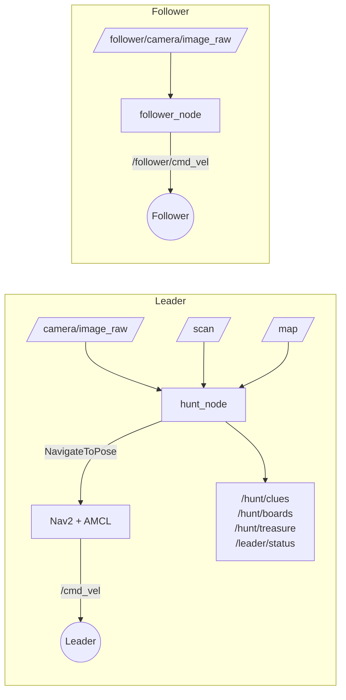

# Clue Chain Hunt - `clue_hunt_solver`

Autonomous clue hunt for the **Inter IIT Bootcamp - Phase 2 Hardware PS** (IIT Guwahati Tech Board).

A **leader** robot (360° LiDAR + RGB camera) reads a chain of ArUco + QR clue boards in an unknown arena and drives to the treasure. A **follower** robot (RGB camera + wheel odometry only) tracks the ArUco tag on the leader's back and stays 0.6-2.0 m behind it. Everything runs from a single launch command with no human input.

> Stack: Ubuntu 22.04 · ROS 2 Humble · Gazebo Fortress · Nav2 · slam_toolbox · OpenCV

---

## Features

- ArUco (`DICT_4X4_50`, 0.24 m) detection with `solvePnP` (IPPE_SQUARE + ITERATIVE, lowest reprojection error wins)
- Board poses transformed into the `map` frame with TF2 and refined by a median over the closest views
- QR region projected from the marker pose, cropped and decoded (multi-scale + CLAHE)
- Hash-chained clue validation - rejects decoy and look-alike boards
- Clue commands: `GOTO`, `REL`, `PILLAR`, `BETWEEN`, and the final `TREASURE`
- Pillars (RED / GREEN / BLUE) located at run time from camera colour blob + LiDAR range
- Ring search around the hinted point, then a grid tour as fallback
- Nav2 navigation (AMCL on the saved map) with `slam_toolbox` for mapping
- Camera-only follower: breadcrumb trail + pure pursuit + leader speed feed-forward

## Architecture



## Repository layout

```
clue_hunt_solver/
├── clue_hunt_solver/
│   ├── common.py          # image conversion, ArUco detector, solvePnP, QR crop/decode, pose maths
│   ├── hunt_node.py       # leader: vision, clue logic, search, Nav2 goals
│   └── follower_node.py   # follower: tag tracking + trail following
├── launch/                # simulation, mapping, Nav2 and hunt launch files
├── config/
│   └── nav2_params.yaml   # AMCL, controller, costmaps, planner, behaviors
├── maps/
│   ├── map.yaml           # saved arena map
│   └── map.pgm
├── package.xml
├── setup.py
└── README.md
```

## Run

> Launch file names below are examples - use the names in this package's `launch/` folder.

**1. Map the arena (once)**

```bash
ros2 launch clue_hunt_solver mapping.launch.py      # Gazebo + slam_toolbox
# drive the leader around, then save:
ros2 run nav2_map_server map_saver_cli -f ~/ws/src/clue_hunt_solver/maps/map
```

**2. Full autonomous hunt (single command)**

```bash
ros2 launch clue_hunt_solver hunt.launch.py          # Gazebo, bridges, Nav2 + AMCL, hunt_node, follower_node
```

The leader waits for Nav2, the map and the camera, seeds AMCL at the origin, reads board 1 from its start pose, and follows the chain to the treasure. The follower starts tracking as soon as it sees tag 49. Open RViz2 to watch the map, boards and both robots.

**3. Optional - run nodes individually**

```bash
ros2 run clue_hunt_solver hunt_node
ros2 run clue_hunt_solver follower_node --ros-args -p v_max:=0.6 -p d_des:=1.3
```

## Topics

| Topic | Type | Description |
|---|---|---|
| `/hunt/clues` | `std_msgs/String` | Full text of every valid clue, in order |
| `/hunt/boards` | `std_msgs/String` | `"id x y"` - board position in the map frame |
| `/hunt/treasure` | `geometry_msgs/PoseStamped` | Treasure position in the map frame |
| `/leader/status` | `std_msgs/String` | `MOVING`, `SEARCHING`, `READING`, `DONE` |
| `/follower/cmd_vel` | `geometry_msgs/Twist` | Follower velocity command |

Inputs: `/camera/image_raw`, `/camera/camera_info`, `/scan`, `/map` (leader); `/follower/camera/image_raw`, `/follower/camera/camera_info` (follower).

Frames: leader `map`, `odom`, `base_link`, `cam_optical_link`, `lidar_link`; follower `follower/odom`, `follower/base_footprint`, `follower/cam_optical_link`.

## Clue format

```
HUNT:<id>:<token>:<command>
```

- `token` = first 4 hex chars (upper case) of `SHA-1(previous clue text)`; board 1 uses `START`.
- A clue is accepted only if `id` is the expected index **and** the token matches.

| Command | Meaning |
|---|---|
| `GOTO x y` | Next board near (x, y) in the map frame |
| `REL a b` | Point `a` m out of the board face and `b` m to the reader's right |
| `PILLAR <COLOUR>` | Next board near the pillar of that colour |
| `BETWEEN <A> <B> <f>` | Point `A + f·(B − A)` between two pillars |
| `TREASURE …` prefix | Final clue; the position is the treasure |

## How it works

**Leader (`hunt_node`)**
1. Detect markers → `solvePnP` → reject flipped solutions (normal must face the camera, range ≤ 5.5 m).
2. Transform to `map` with TF at the image timestamp; keep candidates per id and position; pose = median of the 10 closest views.
3. Approach the nearest candidate to a 1.2 m stand-off on free space (map dilated by 0.35 m, unknown = blocked), face it, decode the QR (retry at 0.9 m and 1.6 m).
4. Validate id + token; otherwise mark the candidate rejected and try the next.
5. Parse the command, choose the search centre, visit it and 6 ring points (r = 1.3 m) with a 360° spin at each, then fall back to a grid tour.
6. On the `TREASURE` clue drive to the point and publish `/hunt/treasure`, status `DONE`.

**Follower (`follower_node`)**
1. Detect tag 49 (0.12 m); leader centre = tag position − 0.21 m along the normal; transform to `follower/odom`.
2. Add a breadcrumb every 0.12 m; estimate leader speed with a low-pass filter.
3. Pure pursuit on the trail (lookahead 0.7 m); `v = v_leader + kp·(d − d_des)`; stand still and face the leader below `d_stop`.
4. If the tag is lost, keep following crumbs briefly, then rotate to search.

## Parameters

| Node | Parameter | Default | Meaning |
|---|---|---|---|
| `hunt_node` | `tag_size` | 0.24 | Board marker size (m) |
| `hunt_node` | `standoff` | 1.2 | Reading distance from a board (m) |
| `hunt_node` | `search_radius` | 1.3 | Ring radius for the area search (m) |
| `follower_node` | `tag_id` / `tag_size` | 49 / 0.12 | Leader tag |
| `follower_node` | `tag_behind_centre` | 0.21 | Tag-to-leader-centre offset (m) |
| `follower_node` | `d_stop` / `d_des` | 0.9 / 1.2 | Stand-still and desired gap (m) |
| `follower_node` | `kp_gap` | 1.5 | Speed gain per metre of gap error |
| `follower_node` | `lookahead` | 0.7 | Pure-pursuit distance (m) |
| `follower_node` | `lost_drive_time` | 3.0 | Seconds to follow crumbs after losing the tag |
| `follower_node` | `v_max` / `w_max` | 0.7 / 1.5 | Speed limits (m/s, rad/s) |

Nav2 settings (controller speed 0.35 m/s, robot radius 0.28 m, inflation 0.45 m) are in `config/nav2_params.yaml`.

## Known limitations

- The tag is only on the leader's back, so very sharp leader turns (> 90°) or in-place rotations can take it out of the follower's view. Slower leader turns (lower `rotate_to_heading_angular_vel` and `desired_linear_vel` in the Nav2 params) make following more reliable.
- Edge-on tag views give an ambiguous normal and a noisy leader-centre estimate.
- Boards farther than 3.8 m are ignored until the leader gets closer.
- Pillar detection depends on the HSV thresholds in `hunt_node.py` and can fail under strong lighting changes or occlusion.

## Troubleshooting

| Symptom | Check |
|---|---|
| Leader never starts | Nav2 action server up? `/map` published (transient local)? Camera info received? AMCL initial pose set? |
| No board pose | TF `map → cam_optical_link` available? `tag_size` equals the real marker size (0.24 m)? |
| QR not decoded | Get closer than 2.8 m; check lighting; look at the projected crop region |
| Follower spins in place | Tag 49 not visible; check `/follower/camera/image_raw` and the `follower/` TF tree |
| Everything is stale in Gazebo | Use `use_sim_time:=true` on every node |

## Deliverables

Technical report (≤ 5 pages), demo video (one uninterrupted autonomous run showing Gazebo and RViz2), this package with the saved map, and this README.

## Credits

Built for the Inter IIT Bootcamp Phase 2 Hardware PS by IIT Guwahati Tech Board. Starter package: Club-Handler/Clue_Chain_Hunt_Bootcamp.
